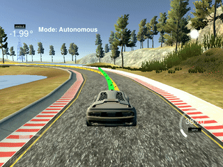

# SDC - Path Planning and Control Projects

Path planning and Control related projects of Udacity's Self-driving Car Nanodegree Program:  
* [PID Control](./PIDControl/)
* [Model Predictive Control](./ModelPredictiveControl/)
* [Path Planning](./PathPlanning/)

## PID Control

  

## Model Predictive Control

  

## Path Planning

Coming soon..  
